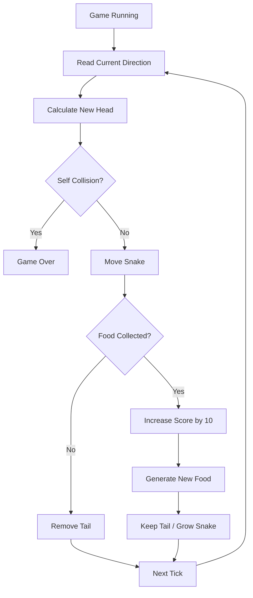
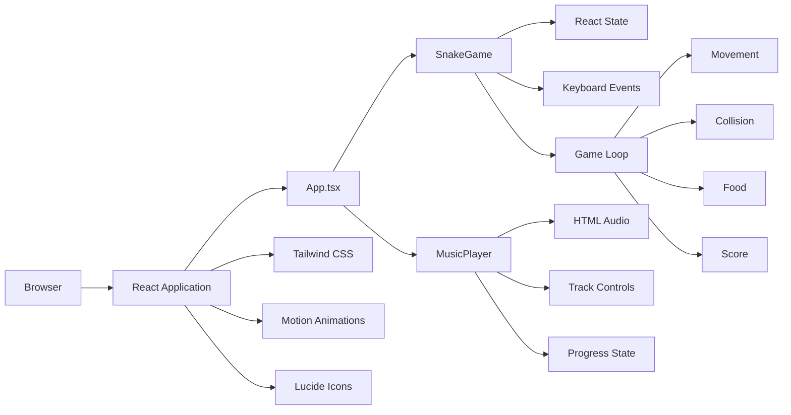
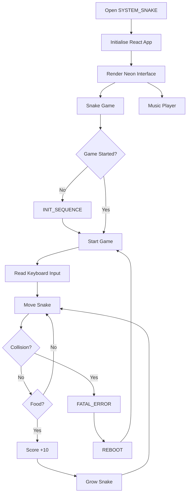
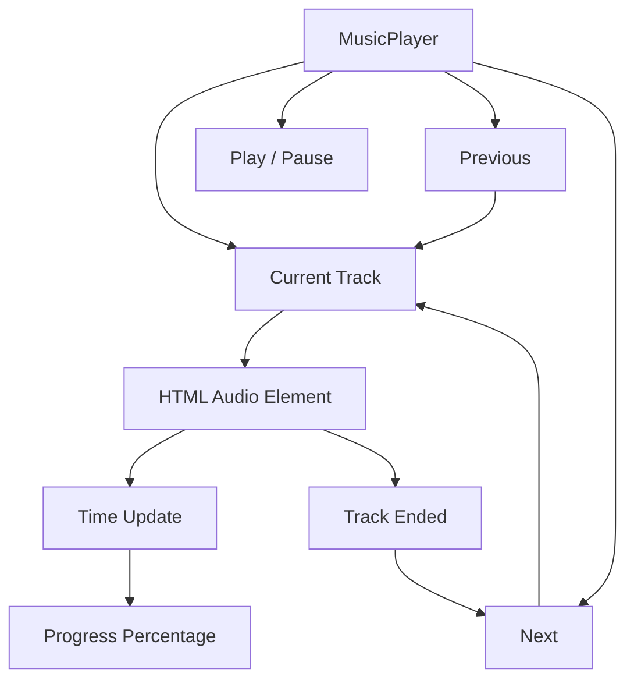
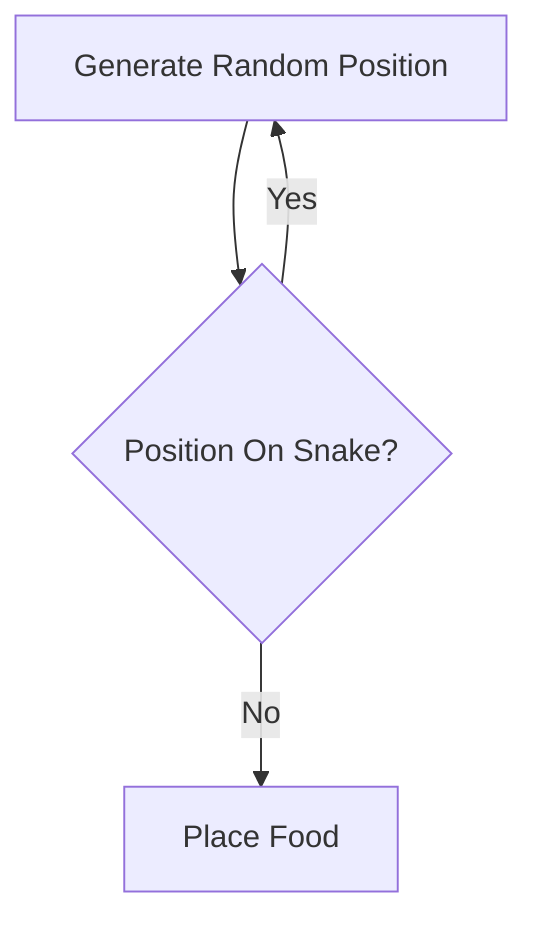

# 🐍 SYSTEM_SNAKE — Neon Snake & Beats

> A dark neon-themed Snake game with an integrated music player, built as a browser-based arcade experience using React, TypeScript, Vite, Tailwind CSS, Motion, and Lucide React.


---

## 🎮 Overview

**SYSTEM_SNAKE** is a retro-futuristic Snake game presented as a neon terminal / arcade interface.

The project combines two interactive experiences:

1. 🐍 **Snake gameplay** — control a snake on a 20×20 grid, collect data orbs, grow the snake, and avoid self-collision.
2. 🎵 **Music player** — play, pause, and switch between three themed background tracks while playing.

The interface is intentionally styled like a futuristic CRT terminal with:

- Neon cyan, magenta, and yellow accents
- Pixel typography
- Scanline effects
- Glitch animations
- CRT overlay
- Retro arcade controls
- Animated food/data orbs
- Motion-based UI entrance animations

The repository currently contains the playable frontend application and is described by the project metadata as **“Neon Snake & Beats.”**

---

# ✨ Features

## 🐍 Snake Game

- 20×20 game grid
- Classic snake movement
- Arrow-key controls
- Spacebar pause/resume
- Food/data-orb collection
- Snake growth after collecting food
- Score system
- +10 score per collected orb
- Self-collision detection
- Wrap-around movement at grid boundaries
- Start screen
- Pause / resume state
- Game-over screen
- One-click reboot / restart
- Animated food orb
- Neon snake head and body styling

## 🎵 Music Player

- Integrated audio player
- Play / pause
- Previous track
- Next track
- Automatic next-track transition
- Playback progress indicator
- Three themed tracks
- Track title and artist display
- Visual track color changes
- Audio status indicator

### Included tracks

| Track | Artist |
|---|---|
| `CORRUPT_WAVE` | `NULL_PTR` |
| `VOID_SIGNAL` | `VOID_EXE` |
| `STATIC_NOISE` | `ERR_404` |

The player uses remote MP3 sources defined in the `MusicPlayer` component.

---

# 🎨 Visual Experience

The interface follows a deliberately retro-futuristic visual language.

```text
┌─────────────────────────────────────────────────────────────┐
│                      SYSTEM_SNAKE                           │
│                 ───────────────────                         │
│                                                             │
│  ┌─────────────────┐      ┌─────────────────────┐           │
│  │  PROTOCOL_INFO  │      │                     │           │
│  │                 │      │    SNAKE GRID       │           │
│  │ > ARROW_KEYS    │      │                     │           │
│  │ > DATA_ORBS     │      │       🐍 ●          │           │
│  │ > SELF_COLLISION│      │                     │           │
│  └─────────────────┘      └─────────────────────┘           │
│                                                             │
│                           ┌─────────────────────┐            │
│                           │    MUSIC PLAYER     │            │
│                           │   CORRUPT_WAVE      │            │
│                           │  ◀     ▶     ▶      │            │
│                           └─────────────────────┘            │
└─────────────────────────────────────────────────────────────┘
```

### Theme elements

- `#00FFFF` — neon cyan
- `#FF00FF` — neon magenta
- `#FFFF00` — neon yellow
- Black background
- Pixel font: **Press Start 2P**
- Glitch text animation
- CRT scanlines
- CRT overlay
- Neon box shadows

---

# 🧠 Game Mechanics

The game uses a simple deterministic update loop driven by React state and a timed interval.

### Initial state

```text
Grid:          20 × 20
Initial snake: 3 segments
Initial head:  (10, 10)
Initial food:  (5, 5)
Initial score: 0
Speed:         150 ms/update
```

### Game loop



---

# 🗺️ Grid & Movement

The game board is a **20×20 grid**.

Each cell is rendered at:

```text
20px × 20px
```

Therefore the main board is:

```text
20 × 20 cells
       ↓
400 × 400 pixels
```

Movement is calculated using modular arithmetic:

```text
newX = (headX + directionX + GRID_SIZE) % GRID_SIZE
newY = (headY + directionY + GRID_SIZE) % GRID_SIZE
```

This means crossing one edge of the board moves the snake to the opposite side.

```text
┌──────────────────────────┐
│                          │
│  → → → → →               │
│                          │
│                          │
│                          │
└──────────────────────────┘
          │
          ▼
┌──────────────────────────┐
│                          │
│                          │
│  → → → → →               │
│                          │
│                          │
└──────────────────────────┘

Edge wrapping is enabled.
```

---

# 🎯 Controls

| Input | Action |
|---|---|
| `↑` | Move up |
| `↓` | Move down |
| `←` | Move left |
| `→` | Move right |
| `Space` | Pause / resume |
| `[INIT_SEQUENCE]` | Start game |
| `[HALT]` | Pause game |
| `[RESUME]` | Resume game |
| `[REBOOT]` | Restart after game over |

The direction system prevents immediate reversal into the opposite axis.

For example:

```text
Moving UP
   ↓
LEFT / RIGHT allowed
DOWN blocked
```

---

# 🧩 Game State

The Snake component maintains the primary game state with React hooks.

```text
snake
 ├── body segments
 └── head position

food
 └── current food position

direction
 └── current movement vector

gameOver
 └── collision state

score
 └── current score

isPaused
 └── start / pause / resume state
```

---

# 🏗️ Application Architecture



---

# 🔄 Application Flow



---

# 🎵 Music Architecture

The music player is implemented as a standalone React component.



### Player behavior

```text
Track 1
   │
   ▼
Track 2
   │
   ▼
Track 3
   │
   ▼
Track 1
```

The player automatically cycles back to the first track after the last track.

---

# 📁 Project Structure

```text
vibe-code/
│
├── src/
│   ├── components/
│   │   ├── SnakeGame.tsx
│   │   └── MusicPlayer.tsx
│   │
│   ├── App.tsx
│   ├── main.tsx
│   └── index.css
│
├── .env.example
├── .gitignore
├── index.html
├── metadata.json
├── package.json
├── tsconfig.json
├── vite.config.ts
└── README.md
```

### Component responsibilities

| File | Responsibility |
|---|---|
| `src/App.tsx` | Main page composition and layout |
| `src/components/SnakeGame.tsx` | Complete Snake game logic and rendering |
| `src/components/MusicPlayer.tsx` | Audio playback and track controls |
| `src/main.tsx` | React application entry point |
| `src/index.css` | Global styling, theme, CRT effects and animations |
| `vite.config.ts` | Vite + React + Tailwind configuration |
| `metadata.json` | AI Studio project metadata |

---

# 🧱 Component Design

## `App`

The root component assembles the complete experience:

```text
App
├── Header
├── Protocol Info
├── Kernel Status
├── SnakeGame
├── MusicPlayer
└── Footer
```

The main layout uses responsive Tailwind grid classes so the side panels adapt to smaller screens.

---

## `SnakeGame`

Responsible for:

- Game state
- Movement
- Keyboard input
- Collision detection
- Food generation
- Score calculation
- Pause/resume
- Game reset
- Grid rendering
- Game-over overlay

---

## `MusicPlayer`

Responsible for:

- Current track state
- Audio element
- Play/pause
- Previous/next navigation
- Progress tracking
- Track completion handling
- Track metadata presentation

---

# ⚙️ Technology Stack

| Category | Technology |
|---|---|
| UI | React 19 |
| Language | TypeScript |
| Build Tool | Vite 6 |
| Styling | Tailwind CSS 4 |
| Animation | Motion |
| Icons | Lucide React |
| Audio | HTML5 Audio API |
| Font | Press Start 2P |
| Package Manager | npm |
| Development | Google AI Studio / Vite workflow |

The repository also contains `@google/genai` and Gemini environment configuration inherited from the AI Studio project setup. The current Snake and music gameplay shown in the source is implemented locally in the React components.

---

# 🔌 Dependencies

The project uses the following primary packages:

```text
react
react-dom
vite
typescript
@vitejs/plugin-react
tailwindcss
@tailwindcss/vite
motion
lucide-react
@google/genai
express
dotenv
tsx
```

The main gameplay experience does not require a backend database.

---

# 🌐 Environment Configuration

The repository includes an `.env.example` based on the AI Studio project setup.

```env
GEMINI_API_KEY="MY_GEMINI_API_KEY"
APP_URL="MY_APP_URL"
```

### Important

The current game implementation does not use Gemini directly for Snake movement, collision, scoring, or music playback.

If Gemini functionality is added later, keep the API key in an appropriate environment/secrets configuration and never commit real credentials.

---

# 🚀 Run Locally

## 1. Clone the repository

```bash
git clone https://github.com/Naveenbabu45/vibe-code.git
cd vibe-code
```

## 2. Install dependencies

```bash
npm install
```

## 3. Configure environment variables

If your environment requires the AI Studio configuration:

```bash
cp .env.example .env.local
```

Then configure the required values.

## 4. Start development server

```bash
npm run dev
```

The Vite development server is configured to run on:

```text
http://localhost:3000
```

## 5. Build for production

```bash
npm run build
```

## 6. Preview production build

```bash
npm run preview
```

---

# 🧪 Available Scripts

| Command | Purpose |
|---|---|
| `npm run dev` | Start Vite development server on port 3000 |
| `npm run build` | Build the production application |
| `npm run preview` | Preview the production build |
| `npm run clean` | Remove the `dist` directory |
| `npm run lint` | Run TypeScript type checking |

---

# 🖥️ User Experience

### Initial screen

The application opens with:

```text
SYSTEM_SNAKE
──────────────

PROTOCOL_INFO       SNAKE GAME       MUSIC PLAYER
```

The Snake game initially waits for input.

```text
[INIT_SEQUENCE]

AWAITING_INPUT...
```

### During gameplay

```text
DATA: 30                              [HALT]

┌─────────────────────────────────┐
│                                 │
│             🟪                  │
│                                 │
│       🐍🐍🐍                   │
│                                 │
│                                 │
└─────────────────────────────────┘
```

### Game over

```text
FATAL_ERROR

CORE_DUMP: 120

[REBOOT]
```

---

# 🧮 Scoring

Every successful food/data-orb collection adds:

```text
+10 points
```

Example:

```text
Start       → 0
1 orb       → 10
2 orbs      → 20
5 orbs      → 50
10 orbs     → 100
```

The snake also grows whenever food is collected.

---

# 💡 Food Generation

Food is randomly generated within the 20×20 grid.

The implementation checks whether the generated position overlaps the snake body.



This prevents food from spawning directly inside the snake.

---

# 💥 Collision System

The current implementation detects **self-collision**.

```text
New Head Position
        │
        ▼
Compare with Snake Body
        │
        ├── No match → Continue
        │
        └── Match → Game Over
```

When collision occurs:

```text
gameOver = true
```

The active game interval is stopped and the interface displays the reboot screen.

---

# ⏸️ Pause System

The game can be paused through:

- Spacebar
- `[HALT]` button

When paused:

```text
Game interval → stopped
Snake movement → stopped
State → preserved
```

Resuming continues from the existing state rather than resetting the game.

---

# 🎞️ Animation System

Motion is used for interface entrance animations.

The main interface includes animations such as:

```text
Header
  └── Fade + horizontal entrance

Snake area
  └── Fade + scale entrance

Music panel
  └── Fade + horizontal entrance
```

CSS also provides:

- Glitch text animation
- Scanline animation
- CRT overlay
- Pulsing food animation
- Neon hover transitions

---

# 🎨 Styling System

The project defines custom Tailwind theme values:

```css
--color-glitch-cyan: #00ffff;
--color-glitch-magenta: #ff00ff;
--color-glitch-yellow: #ffff00;
--font-pixel: "Press Start 2P", cursive;
```

This creates a consistent visual language across:

```text
Game
├── Snake
├── Food
├── Score
├── Controls
├── Music Player
├── Headers
└── Status Panels
```

---

# 📱 Responsive Layout

The main application uses responsive Tailwind classes.

```text
Desktop
┌────────────┬───────────────┬────────────┐
│ Info Panel │   Snake Game  │   Music    │
└────────────┴───────────────┴────────────┘

Mobile
┌─────────────────────────────┐
│        SYSTEM_SNAKE         │
│                             │
│        Snake Game           │
│                             │
│        Music Player         │
└─────────────────────────────┘
```

The larger desktop layout displays the side information panels while smaller screens prioritize the main game experience.

---

# 🔐 Security Notes

This is primarily a client-side arcade project.

There is:

- No application database
- No user authentication
- No personal user data workflow
- No server-side game state
- No persistent score storage

If external API functionality is added later, API credentials should be managed through secure environment variables rather than committed to source control.

---

# 🛣️ Future Enhancements

Potential improvements for future versions:

- [ ] Persistent high scores
- [ ] Difficulty levels
- [ ] Increasing snake speed
- [ ] Mobile touch controls
- [ ] Swipe gestures
- [ ] Sound effects
- [ ] Custom music upload
- [ ] More music tracks
- [ ] Multiple game modes
- [ ] Obstacles
- [ ] Power-ups
- [ ] Local leaderboard
- [ ] Online leaderboard
- [ ] Player name / profile
- [ ] Game statistics
- [ ] Accessibility improvements
- [ ] Pause menu settings
- [ ] Theme selector
- [ ] Fullscreen game mode

---

# 📊 Current Project Scope

```text
                 SYSTEM_SNAKE
                       │
          ┌────────────┴────────────┐
          ▼                         ▼
      GAME ENGINE               MUSIC PLAYER
          │                         │
    ┌─────┼─────┐             ┌────┼────┐
    ▼     ▼     ▼             ▼    ▼    ▼
 Movement Food Score        Play  Next  Prev
    │     │     │             │    │    │
    └─────┼─────┘             └────┼────┘
          ▼                         ▼
       Collision                Progress
          │                         │
          └────────────┬────────────┘
                       ▼
                 Arcade UI
```

---

# 📚 Learning Outcomes

This project demonstrates practical experience with:

- React functional components
- React hooks
- `useState`
- `useEffect`
- `useCallback`
- `useRef`
- Keyboard event handling
- Timed game loops
- Collision detection
- Randomized object generation
- Responsive layouts
- Tailwind CSS
- TypeScript configuration
- Vite
- Motion animations
- HTML5 Audio
- Component-based UI design
- CSS animations
- Custom design systems
- Environment configuration

---

# 🧭 Development Architecture

The project follows a lightweight component-oriented architecture:

```text
React Root
    │
    ▼
   App
    │
    ├───────────────┐
    ▼               ▼
SnakeGame       MusicPlayer
    │               │
    ├── State       ├── Track State
    ├── Input       ├── Audio
    ├── Loop        ├── Controls
    ├── Collision   └── Progress
    ├── Food
    └── Score
```

This keeps the game engine and audio experience independent while allowing both to be composed inside the main application.

---

# ⚠️ Project Notes

- The game uses browser-side React state, so the score resets when the page is refreshed.
- Audio tracks are loaded from remote URLs defined in `MusicPlayer.tsx`.
- Browser autoplay restrictions may require the user to interact with the page before audio starts.
- The repository's Gemini configuration comes from the AI Studio project setup; the current Snake gameplay itself is not Gemini-dependent.
- The project is best understood as an interactive frontend arcade experiment rather than a production backend application.

---

# 👨‍💻 Author

**Naveen Babu**

B.Tech Computer Science & Engineering Student

- GitHub: https://github.com/Naveenbabu45
- LinkedIn: https://www.linkedin.com/in/kommmavarapunaveenbabu
- Portfolio: https://naveen-portfolio-swart-rho.vercel.app/

---

# 🔗 Repository

**GitHub:**  
https://github.com/Naveenbabu45/vibe-code

---

## ⭐ Project Summary

**SYSTEM_SNAKE** is a compact browser arcade experience that combines classic Snake mechanics with a neon CRT-inspired interface and an integrated music player.

```text
       ┌──────────────────────────┐
       │       SYSTEM_SNAKE       │
       └────────────┬─────────────┘
                    │
        ┌───────────┴───────────┐
        ▼                       ▼
   🐍 Snake Game           🎵 Music Player
        │                       │
   Movement                Play / Pause
   Food                    Previous / Next
   Score                   Progress
   Collision               Auto Advance
        │                       │
        └───────────┬───────────┘
                    ▼
             Neon Arcade UI
```

> Built as an interactive frontend project exploring game logic, React state management, browser APIs, animation, and creative UI design.
